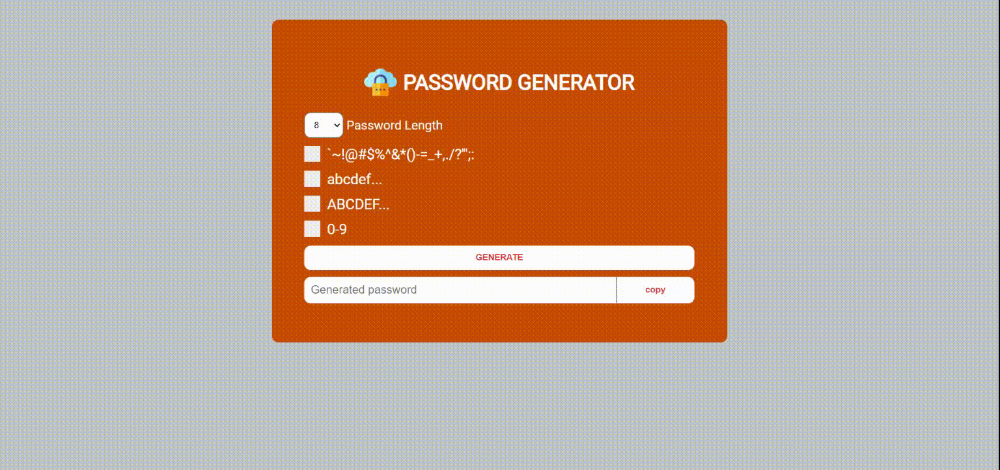

# Password Generator

## demo

## Feature

- Generate password based on length, special symbols, numbers, uppercase letters, lowercase letters
- Users can personalise the input.

## Possible symbols

- `~!@#$%^&*()-=_+,./?';:
- abcd...z
- ABCD...Z
- 0-9

## Formula

for(i=0;i<length;i+){
  generatedPassword += finalString.charAt(Math.floor(Math.random()*finalString.length));
}

### Made in pure vanilla script

